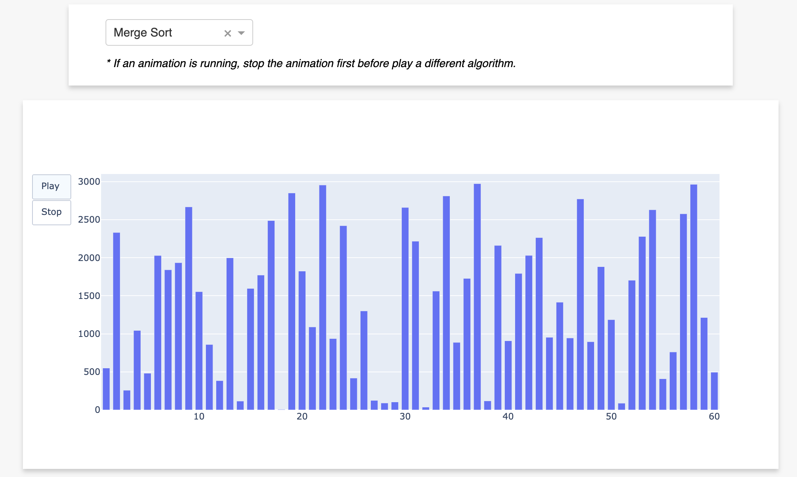
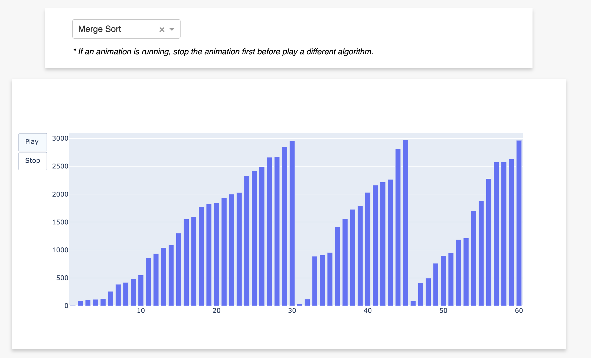

## Overview

This is a sorting algorithm visualization web app using [Dash](https://dash.plotly.com/introduction) and [Plotly](https://plotly.com/graphing-libraries/). 

The application has been deployed on Heroku. 
[App link](https://sorting-visualization-dash.herokuapp.com/)

As shown in the picture below, one can choose a sorting algorithm from the dropdown menu. 

The application will show how vertical bars being sorted by the chosen algorithm. The picture below shows an intermediate status when using merge sort. 

## To-Dos: 
So far, we've only implemented Bubble Sort and Merge Sort. We'd like to add more sorting algorithms in the furture. 
