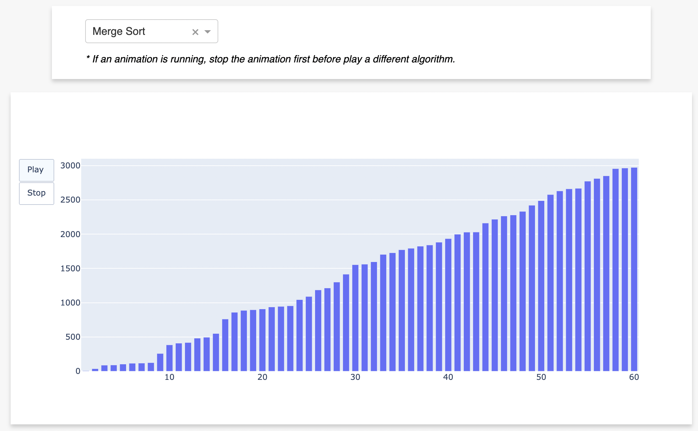

## Overview

This is a sorting algorithm visualization web app using [Dash](https://dash.plotly.com/introduction) and [Plotly](https://plotly.com/graphing-libraries/). 

## Why this project

The initial motivation for this project is for me to gain some tangential knowledge of how a web application works in general. 

There is also a sister project using Flask and Matplotlib ([Repo](https://github.com/yinghu-math/sorting_visual_matplotlib_flask)), which isn't deployed. 

## Web App

The application is deployed on Heroku. 
[App link](https://sorting-visualization-dash.herokuapp.com/)

As shown in the picture below, one can choose a sorting algorithm from the dropdown menu. 

The application will animate the process of sorting the bars with the chosen algorithm.  

## Add Additional sorting algorithms: 

Sorting algorithm implementations are contained in `sorting_steps.py`.  There is a function defined for each algorithm, which returns the sorting steps as a list of arrays. The output arrays are then used by the process `generate_animated_figure` in `app.py` to generate animation frames. 

So far, we've implemented bubble sort and merge sort. If needed,  additional sorting algorithms can be easily added to the app. 
